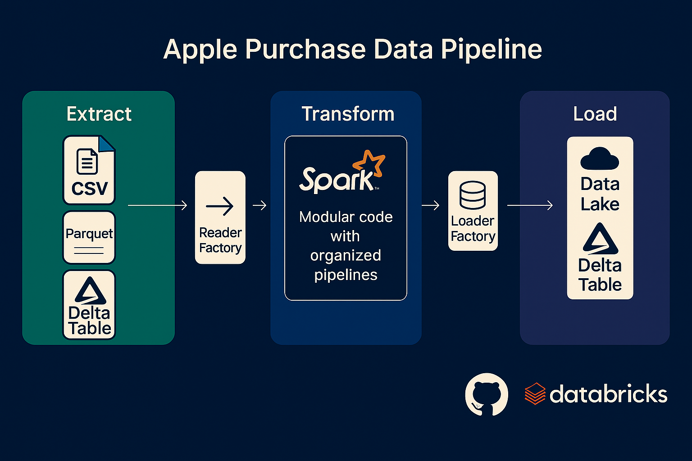

# Apple Purchase Data Pipeline

This project showcases a modular ETL pipeline built with PySpark on Databricks, designed to analyze customer purchase behavior. The goal? Understand product purchase patterns — like who buys AirPods after buying an iPhone — and much more.

This work was inspired by Ankur Rajan’s demo lecture. I must say, he’s a genius at simplifying complex ideas.

---

## 🔍 The Problem

We had a simple challenge: identify how customers buy across Apple products — which products come first, how quickly do they return for more, and what combinations sell together?

To solve that, we built five workflows using PySpark — each answering a different business question.

---

## 🧱 Project Structure

We adopted a clean modular design with three core stages:

### 🗂️ Extract  
- Supports multiple data formats:
  - **CSV** for transaction records  
  - **Parquet** for product metadata  
  - **Delta Table** (created from CSV via UI) for customer data  
- Uses a **Reader Factory** to standardize ingestion

### 🧪 Transform  
- Business logic built using Spark SQL
- Includes multiple reusable Transformer classes:
  - AirPods-after-iPhone detection
  - Only iPhone & AirPods buyers
  - Products bought after first purchase
  - Top revenue products by category
  - Average delay between iPhone and AirPods

Each transformer is independently pluggable.

### 📦 Load  
- Uses a **Loader Factory** to route outputs to:
  - A curated **Delta Table**
  - Or optionally, a **Data Lake**

---
### 🧭 Unity Catalog

To keep everything organized and consistent, I followed a clear naming convention using Unity Catalog in Databricks.

- **Input files** were uploaded to:  
  `/Volumes/workspace/apple_analysis/source_filestore`

- **Output files** were written to:  
  `/Volumes/workspace/apple_analysis/datalake`

- **Delta Tables** (both input and output) were registered under:  
  `workspace.apple_analysis`

This structure makes it easy to manage access, locate data, and maintain clarity across all stages of the pipeline.

---

## 🔁 Diagram

---

## 🧠 Business Questions Solved

1. Who bought AirPods after buying an iPhone?
2. Which customers only bought iPhones and AirPods?
3. What did people buy after their first purchase?
4. What are the top 3 revenue drivers per category?
5. How long do people take to buy AirPods after buying an iPhone?

Each of these was solved using PySpark DataFrames, window functions, filters, joins, and aggregations.

---

## 💻 Environment

All work was done on **Databricks Free Edition**, using:
- Python 3
- PySpark
- Delta Lake
- UI upload for Delta table creation

---

## 🔍 Observability

A basic Job Logger was added to track:
- Job status
- Row counts
- Timestamped checkpoints

This ensures each ETL run is observable and traceable.

---

## 🚀 Getting Started

Want to try it out?

1. Upload the CSVs and Parquet file to your Databricks workspace.
2. Use the UI to register the customer CSV as a Delta Table.
3. Clone the repo and run the notebooks or modular scripts.

You’ll see each workflow in action.

---

## 🙏 Shoutout

This project was heavily inspired by [Ankur Rajan](https://www.youtube.com/watch?v=BlWS4foN9cY&t=114s)’s demo. If you're trying to wrap your head around data pipelines, watch his lecture.

---

## 👋 Let’s Connect

Feel free to explore, fork, and contribute. The code is modular, beginner-friendly, and easy to extend for other purchase scenarios.

